<!-- Generated by scripts/build-readme.mjs. -->

# Image Atlas

> A public, image-first slice of a labeled PNG atlas built for practical human tasks, explainer plates, and searchable visual reference work.

[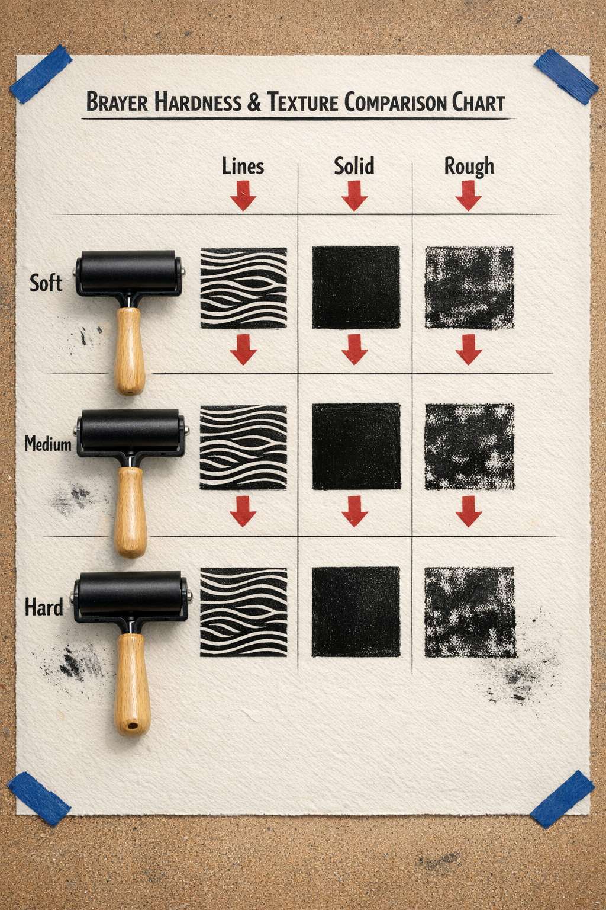](prompts/2026/05/25/20260525-0211-relief-print-registration-and-brayer-course-plates/01-brayer-hardness-and-texture-comparison-chart.prompt.md)

| Public images | Public runs | Search hooks | Formats |
| --- | --- | --- | --- |
| 101 | 10 | 892 | 14 |

## What This Repo Publishes

- Useful labeled image runs instead of generic art dumps.
- Matching prompt cards, research notes, run reports, and static gallery pages for every published PNG.
- A curated public mirror of the larger working atlas, kept small enough for normal GitHub pushes.

## Current Public Gallery

<table>
<tr>
<td width="50%" align="center" valign="top">
  <a href="prompts/2026/05/25/20260525-0211-relief-print-registration-and-brayer-course-plates/01-brayer-hardness-and-texture-comparison-chart.prompt.md"></a>
  <br /><strong>Brayer Hardness And Texture Comparison Chart</strong>
  <br /><sub>infographic-diagram · three relief-print brayers labeled soft · with side-by-side ink rolls</sub>
</td>
<td width="50%" align="center" valign="top">
  <a href="prompts/2026/05/25/20260525-0211-relief-print-registration-and-brayer-course-plates/03-carving-mark-vocabulary-reference-plate.prompt.md">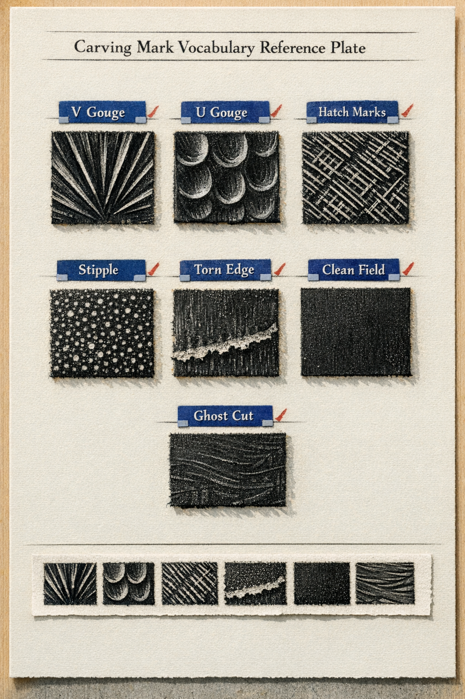</a>
  <br /><strong>Carving Mark Vocabulary Reference Plate</strong>
  <br /><sub>atlas-contact-sheet · U gouge scoop · hatch marks</sub>
</td>
</tr>
<tr>
<td width="50%" align="center" valign="top">
  <a href="prompts/2026/05/25/20260525-0211-relief-print-registration-and-brayer-course-plates/05-reduction-print-step-sequence-poster.prompt.md">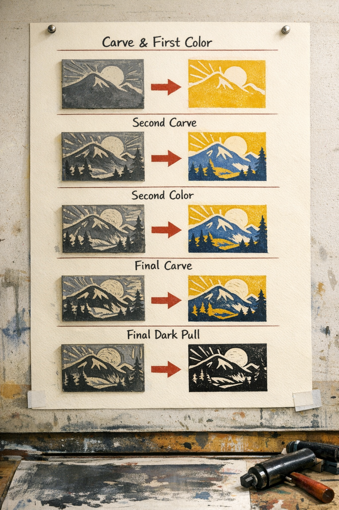</a>
  <br /><strong>Reduction Print Step Sequence Poster</strong>
  <br /><sub>infographic-diagram · second carve · second color</sub>
</td>
<td width="50%" align="center" valign="top">
  <a href="prompts/2026/05/25/20260525-0211-relief-print-registration-and-brayer-course-plates/07-relief-printing-tools-tray-reference.prompt.md"></a>
  <br /><strong>Relief Printing Tools Tray Reference</strong>
  <br /><sub>atlas-contact-sheet · bench hook · V gouges</sub>
</td>
</tr>
<tr>
<td width="50%" align="center" valign="top">
  <a href="prompts/2026/05/22/20260522-0220-cinematography-shot-size-and-blocking-visual-guides/02-camera-angle-and-eyeline-guide.prompt.md">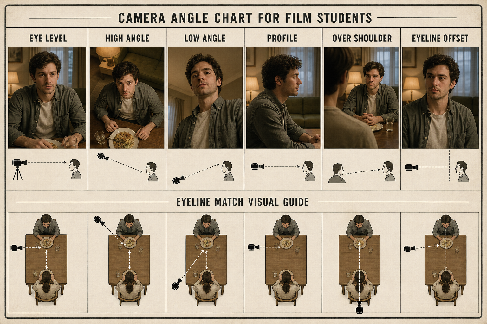</a>
  <br /><strong>Camera Angle And Eyeline Guide</strong>
  <br /><sub>infographic-diagram · HIGH ANGLE · LOW ANGLE</sub>
</td>
<td width="50%" align="center" valign="top">
  <a href="prompts/2026/05/22/20260522-0220-cinematography-shot-size-and-blocking-visual-guides/08-director-viewfinder-tape-marks-and-apple-boxes-atlas.prompt.md">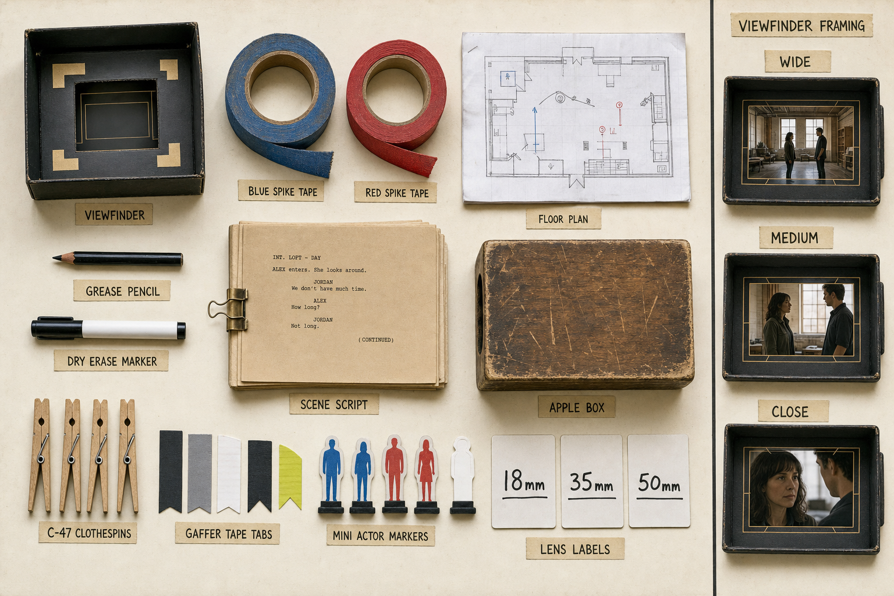</a>
  <br /><strong>Director Viewfinder Tape Marks And Apple Boxes Atlas</strong>
  <br /><sub>atlas-contact-sheet · directors cardboard viewfinder · blue and red spike tape rolls</sub>
</td>
</tr>
<tr>
<td width="50%" align="center" valign="top">
  <a href="prompts/2026/05/21/20260521-1956-predictive-history-pressure-map-boards/03-rival-doctrine-comparison-sheet.prompt.md">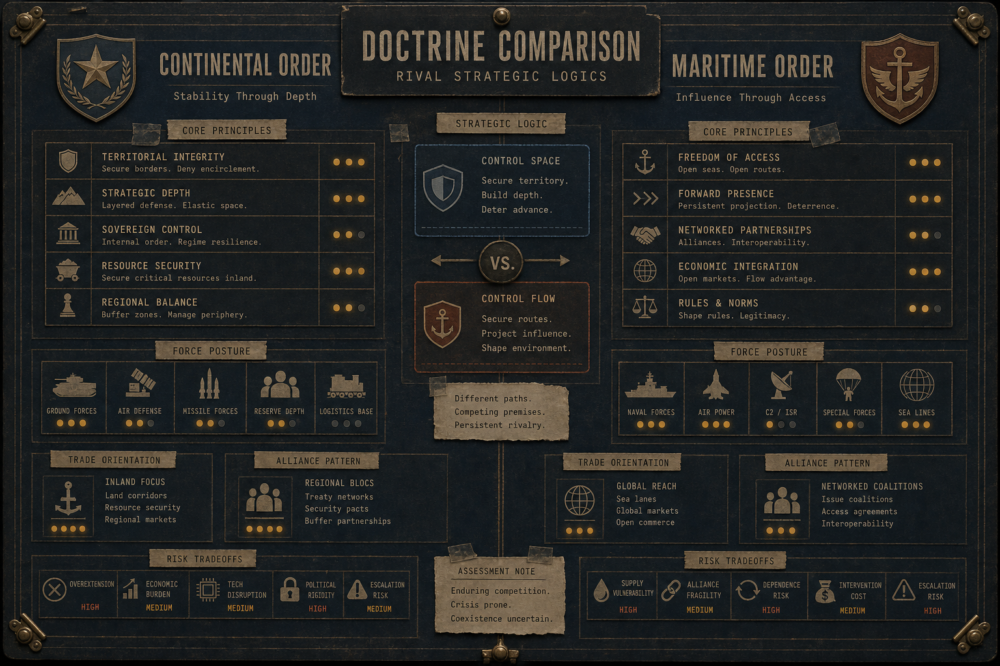</a>
  <br /><strong>Rival Doctrine Comparison Sheet</strong>
  <br /><sub>infographic-diagram · continental order doctrine · maritime order doctrine</sub>
</td>
<td width="50%" align="center" valign="top">
  <a href="prompts/2026/05/21/20260521-1956-predictive-history-pressure-map-boards/04-conflict-escalation-decision-tree.prompt.md">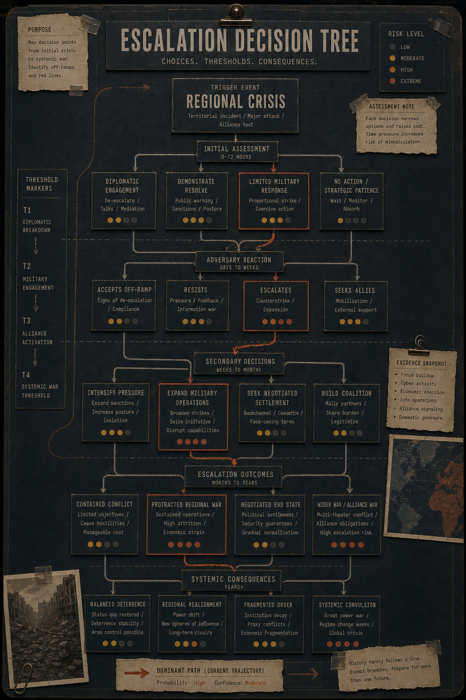</a>
  <br /><strong>Conflict Escalation Decision Tree</strong>
  <br /><sub>infographic-diagram · trigger event · initial assessment</sub>
</td>
</tr>
<tr>
<td width="50%" align="center" valign="top">
  <a href="prompts/2026/05/21/20260521-1956-predictive-history-pressure-map-boards/08-scenario-fork-timeline-board.prompt.md">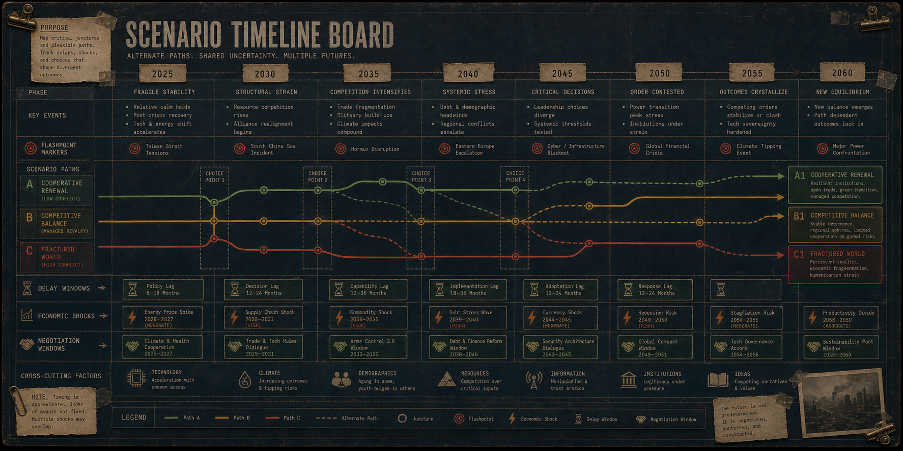</a>
  <br /><strong>Scenario Fork Timeline Board</strong>
  <br /><sub>infographic-diagram · 2025 to 2060 timeline · branching scenario forks</sub>
</td>
<td width="50%" align="center" valign="top">
  <a href="prompts/2026/05/21/20260521-1956-predictive-history-pressure-map-boards/09-documentary-war-room-installation-view.prompt.md"></a>
  <br /><strong>Documentary War Room Installation View</strong>
  <br /><sub>environment-concept · analyst silhouettes · war-room evidence wall</sub>
</td>
</tr>
<tr>
<td width="50%" align="center" valign="top">
  <a href="prompts/2026/05/21/20260521-1553-aquarium-nitrogen-cycle-starter-posters/02-fishless-cycling-timeline-chart.prompt.md"></a>
  <br /><strong>Fishless Cycling Timeline Chart</strong>
  <br /><sub>infographic-diagram · bottled ammonia dropper · thermometer strip</sub>
</td>
<td width="50%" align="center" valign="top">
  <a href="prompts/2026/05/21/20260521-1553-aquarium-nitrogen-cycle-starter-posters/04-beneficial-bacteria-filter-media-taxonomy-plate.prompt.md"></a>
  <br /><strong>Beneficial Bacteria Filter Media Taxonomy Plate</strong>
  <br /><sub>atlas-contact-sheet · ceramic bio-rings · porous lava rock</sub>
</td>
</tr>
<tr>
<td width="50%" align="center" valign="top">
  <a href="prompts/2026/05/21/20260521-1553-aquarium-nitrogen-cycle-starter-posters/06-aquarium-test-kit-color-reading-board.prompt.md"></a>
  <br /><strong>Aquarium Test Kit Color Reading Board</strong>
  <br /><sub>atlas-contact-sheet · ammonia test vial · nitrite test vial</sub>
</td>
<td width="50%" align="center" valign="top">
  <a href="prompts/2026/05/21/20260521-1553-aquarium-nitrogen-cycle-starter-posters/07-new-tank-syndrome-mistakes-poster.prompt.md"></a>
  <br /><strong>New Tank Syndrome Mistakes Poster</strong>
  <br /><sub>infographic-diagram · adding too many fish at once · rinsing filter media under tap water</sub>
</td>
</tr>
<tr>
<td width="50%" align="center" valign="top">
  <a href="prompts/2026/05/21/20260521-1452-protective-braiding-training-guides/03-braid-size-section-grid-poster.prompt.md"></a>
  <br /><strong>Braid Size Section Grid Poster</strong>
  <br /><sub>infographic-diagram · large braid section squares at the top · matching finished braid thickness samples hanging below</sub>
</td>
<td width="50%" align="center" valign="top">
  <a href="prompts/2026/05/21/20260521-1452-protective-braiding-training-guides/04-feed-in-braid-sequence-poster.prompt.md"></a>
  <br /><strong>Feed In Braid Sequence Poster</strong>
  <br /><sub>infographic-diagram · close hand-and-mannequin demonstration of a feed-in cornrow · first added extension piece</sub>
</td>
</tr>
<tr>
<td width="50%" align="center" valign="top">
  <a href="prompts/2026/05/21/20260521-1452-protective-braiding-training-guides/06-braiding-tool-tray-reference.prompt.md"></a>
  <br /><strong>Braiding Tool Tray Reference</strong>
  <br /><sub>atlas-contact-sheet · neatly arranged braiding tools including a rat-tail comb · wide-tooth comb</sub>
</td>
<td width="50%" align="center" valign="top">
  <a href="prompts/2026/05/14/20260514-0205-bicycle-repair-commuter-reference-sheets/02-how-to-patch-a-bicycle-tube-poster.prompt.md"></a>
  <br /><strong>How To Patch A Bicycle Tube Poster</strong>
  <br /><sub>infographic-diagram · tube pull · puncture check in a water basin</sub>
</td>
</tr>
<tr>
<td width="50%" align="center" valign="top">
  <a href="prompts/2026/05/14/20260514-0205-bicycle-repair-commuter-reference-sheets/05-brake-pad-wear-and-rotor-rub-troubleshooting-board.prompt.md"></a>
  <br /><strong>Brake Pad Wear And Rotor Rub Troubleshooting Board</strong>
  <br /><sub>infographic-diagram · direct comparison of healthy brake pads · worn brake pads</sub>
</td>
<td width="50%" align="center" valign="top">
  <a href="prompts/2026/05/14/20260514-0205-bicycle-repair-commuter-reference-sheets/07-saddle-bag-emergency-repair-kit-layout.prompt.md"></a>
  <br /><strong>Saddle Bag Emergency Repair Kit Layout</strong>
  <br /><sub>atlas-contact-sheet · disciplined emergency saddle-bag kit including spare tube · tire levers</sub>
</td>
</tr>
<tr>
<td width="50%" align="center" valign="top">
  <a href="prompts/2026/05/14/20260514-0105-bakery-icing-tip-comparison-wall/03-star-tip-versus-round-tip-border-board.prompt.md"></a>
  <br /><strong>Star Tip Versus Round Tip Border Board</strong>
  <br /><sub>infographic-diagram · including shell border · rope border</sub>
</td>
<td width="50%" align="center" valign="top">
  <a href="prompts/2026/05/14/20260514-0105-bakery-icing-tip-comparison-wall/05-how-to-fill-a-piping-bag-poster.prompt.md"></a>
  <br /><strong>How To Fill A Piping Bag Poster</strong>
  <br /><sub>infographic-diagram · loading buttercream · inserting coupler</sub>
</td>
</tr>
<tr>
<td width="50%" align="center" valign="top">
  <a href="prompts/2026/05/14/20260514-0105-bakery-icing-tip-comparison-wall/07-cake-decorating-tools-tray-reference.prompt.md"></a>
  <br /><strong>Cake Decorating Tools Tray Reference</strong>
  <br /><sub>atlas-contact-sheet · disciplined decorating kit including reusable piping bags · open star tip</sub>
</td>
<td width="50%" align="center" valign="top">
  <a href="prompts/2026/05/25/20260525-0211-relief-print-registration-and-brayer-course-plates/02-linocut-registration-jig-labeled-guide.prompt.md">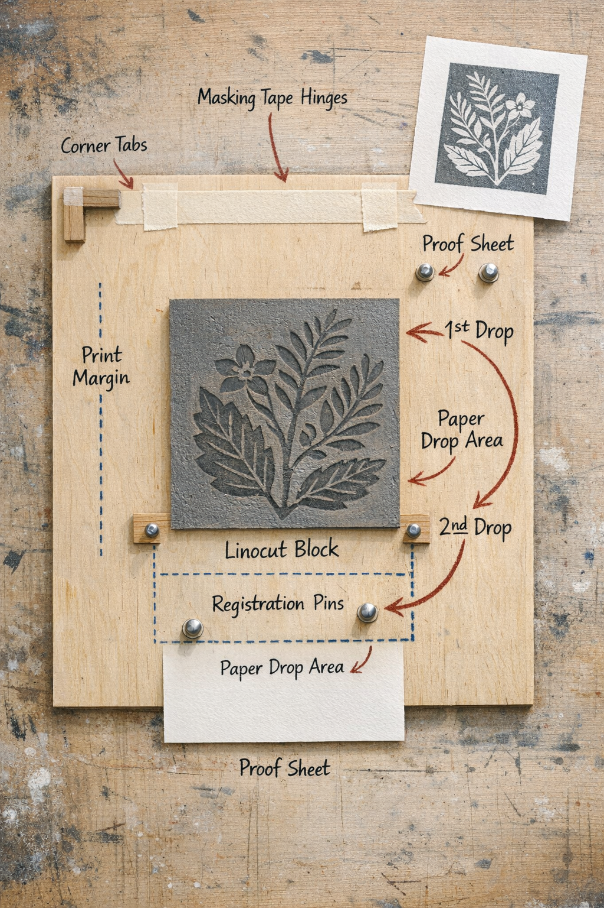</a>
  <br /><strong>Linocut Registration Jig Labeled Guide</strong>
  <br /><sub>scientific-educational · one linocut block · corner tabs</sub>
</td>
</tr>
<tr>
<td width="50%" align="center" valign="top">
  <a href="prompts/2026/05/25/20260525-0211-relief-print-registration-and-brayer-course-plates/04-relief-ink-viscosity-and-slab-roll-chart.prompt.md">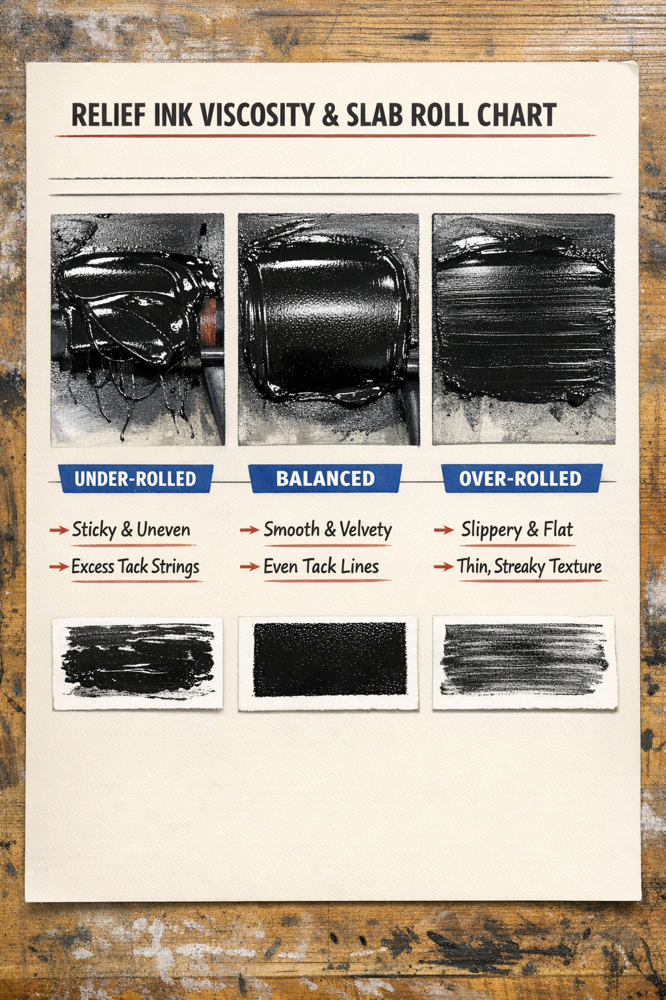</a>
  <br /><strong>Relief Ink Viscosity And Slab Roll Chart</strong>
  <br /><sub>scientific-educational · three side-by-side ink states labeled under-rolled · over-rolled with brayer tracks</sub>
</td>
<td width="50%" align="center" valign="top">
  <a href="prompts/2026/05/22/20260522-0220-cinematography-shot-size-and-blocking-visual-guides/01-shot-size-ladder-reference-poster.prompt.md">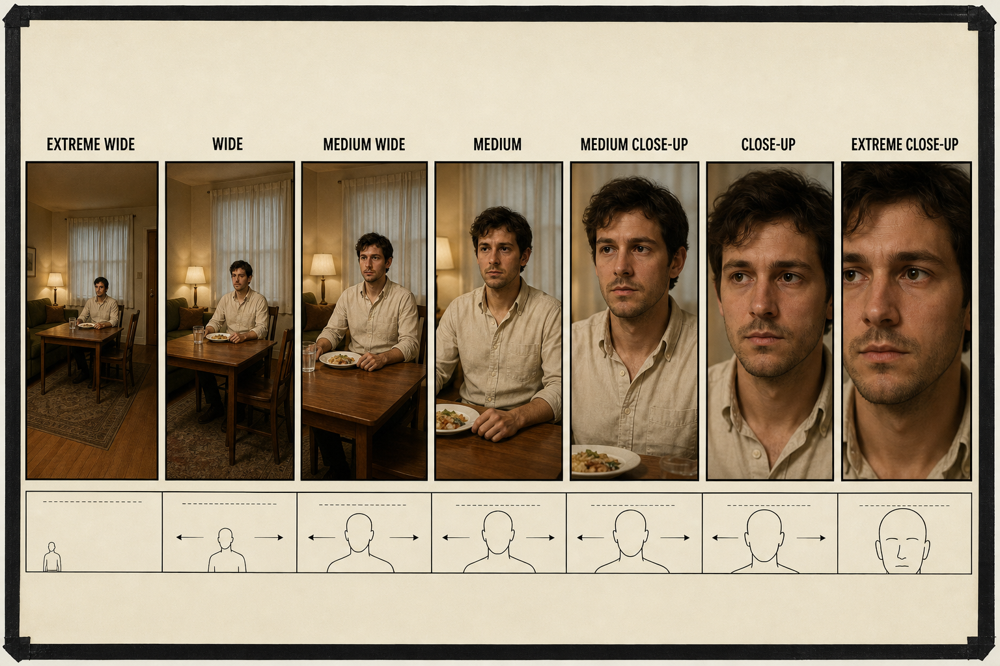</a>
  <br /><strong>Shot Size Ladder Reference Poster</strong>
  <br /><sub>scientific-educational · MEDIUM CLOSE-UP · EXTREME CLOSE-UP</sub>
</td>
</tr>
<tr>
<td width="50%" align="center" valign="top">
  <a href="prompts/2026/05/22/20260522-0220-cinematography-shot-size-and-blocking-visual-guides/03-24mm-50mm-85mm-lens-portrait-strip.prompt.md">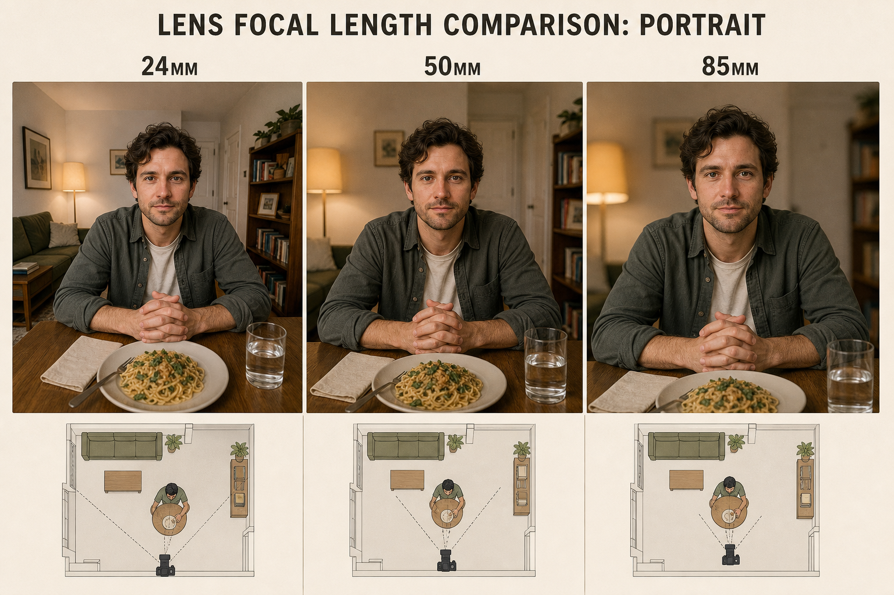</a>
  <br /><strong>24mm 50mm 85mm Lens Portrait Strip</strong>
  <br /><sub>scientific-educational · normal perspective · telephoto compression</sub>
</td>
<td width="50%" align="center" valign="top">
  <a href="prompts/2026/05/21/20260521-1553-aquarium-nitrogen-cycle-starter-posters/01-aquarium-nitrogen-cycle-diagram-poster.prompt.md"></a>
  <br /><strong>Aquarium Nitrogen Cycle Diagram Poster</strong>
  <br /><sub>scientific-educational · decomposing food flakes · ammonia cloud</sub>
</td>
</tr>
<tr>
<td width="50%" align="center" valign="top">
  <a href="prompts/2026/05/21/20260521-1553-aquarium-nitrogen-cycle-starter-posters/03-ammonia-nitrite-nitrate-comparison-guide.prompt.md"></a>
  <br /><strong>Ammonia Nitrite Nitrate Comparison Guide</strong>
  <br /><sub>scientific-educational · ammonia test vial · nitrite test vial</sub>
</td>
<td width="50%" align="center" valign="top">
  <a href="prompts/2026/05/21/20260521-1452-protective-braiding-training-guides/01-box-braids-and-knotless-braids-chart.prompt.md"></a>
  <br /><strong>Box Braids And Knotless Braids Chart</strong>
  <br /><sub>scientific-educational · root start · braid hang</sub>
</td>
</tr>
<tr>
<td width="50%" align="center" valign="top">
  <a href="prompts/2026/05/21/20260521-1452-protective-braiding-training-guides/02-cornrow-parting-pattern-guide.prompt.md"></a>
  <br /><strong>Cornrow Parting Pattern Guide</strong>
  <br /><sub>scientific-educational · curved rows · side-swoop rows</sub>
</td>
<td width="50%" align="center" valign="top">
  <a href="prompts/2026/05/21/20260521-1452-protective-braiding-training-guides/05-tight-braid-warning-signs-chart.prompt.md"></a>
  <br /><strong>Tight Braid Warning Signs Chart</strong>
  <br /><sub>scientific-educational · smooth sections · slight scalp visibility versus redness</sub>
</td>
</tr>
<tr>
<td width="50%" align="center" valign="top">
  <a href="prompts/2026/05/21/20260521-1452-protective-braiding-training-guides/07-extension-fiber-blend-swatch-board.prompt.md"></a>
  <br /><strong>Extension Fiber Blend Swatch Board</strong>
  <br /><sub>scientific-educational · honey ombre · auburn blend</sub>
</td>
<td width="50%" align="center" valign="top">
  <a href="prompts/2026/05/21/20260521-1452-protective-braiding-training-guides/08-bead-cuff-and-endings-plate.prompt.md"></a>
  <br /><strong>Bead Cuff And Endings Plate</strong>
  <br /><sub>scientific-educational · five finished braid-end samples mounted vertically · curled end</sub>
</td>
</tr>
<tr>
<td width="50%" align="center" valign="top">
  <a href="prompts/2026/05/14/20260514-0205-bicycle-repair-commuter-reference-sheets/01-rim-brake-versus-disc-brake-comparison-chart.prompt.md"></a>
  <br /><strong>Rim Brake Versus Disc Brake Comparison Chart</strong>
  <br /><sub>scientific-educational · brake pads touching the rim · brake cable noodle</sub>
</td>
<td width="50%" align="center" valign="top">
  <a href="prompts/2026/05/14/20260514-0205-bicycle-repair-commuter-reference-sheets/03-bike-chain-wear-and-lubrication-guide.prompt.md"></a>
  <br /><strong>Bike Chain Wear And Lubrication Guide</strong>
  <br /><sub>scientific-educational · cleaner chain after brushing · lube bottle applying one drop per roller</sub>
</td>
</tr>
<tr>
<td width="50%" align="center" valign="top">
  <a href="prompts/2026/05/14/20260514-0205-bicycle-repair-commuter-reference-sheets/04-hex-key-sizes-and-bike-bolt-reference.prompt.md"></a>
  <br /><strong>Hex Key Sizes And Bike Bolt Reference</strong>
  <br /><sub>scientific-educational · seatpost clamp bolt · bottle cage bolt</sub>
</td>
<td width="50%" align="center" valign="top">
  <a href="prompts/2026/05/14/20260514-0205-bicycle-repair-commuter-reference-sheets/06-front-and-rear-derailleur-anatomy-diagram.prompt.md"></a>
  <br /><strong>Front And Rear Derailleur Anatomy Diagram</strong>
  <br /><sub>scientific-educational · cable path · barrel adjuster</sub>
</td>
</tr>
<tr>
<td width="50%" align="center" valign="top">
  <a href="prompts/2026/05/14/20260514-0105-bakery-icing-tip-comparison-wall/01-piping-tip-names-and-uses-chart.prompt.md"></a>
  <br /><strong>Piping Tip Names And Uses Chart</strong>
  <br /><sub>scientific-educational · closed star tip · round tip</sub>
</td>
<td width="50%" align="center" valign="top">
  <a href="prompts/2026/05/14/20260514-0105-bakery-icing-tip-comparison-wall/02-buttercream-stiffness-comparison-guide.prompt.md"></a>
  <br /><strong>Buttercream Stiffness Comparison Guide</strong>
  <br /><sub>scientific-educational · medium buttercream · stiff buttercream</sub>
</td>
</tr>
<tr>
<td width="50%" align="center" valign="top">
  <a href="prompts/2026/05/14/20260514-0105-bakery-icing-tip-comparison-wall/04-buttercream-flower-tip-taxonomy.prompt.md"></a>
  <br /><strong>Buttercream Flower Tip Taxonomy</strong>
  <br /><sub>scientific-educational · taxonomy of flower-related piping nozzles including petal tip · leaf tip</sub>
</td>
<td width="50%" align="center" valign="top">
  <a href="prompts/2026/05/14/20260514-0105-bakery-icing-tip-comparison-wall/06-cupcake-swirl-and-rosette-guide.prompt.md"></a>
  <br /><strong>Cupcake Swirl And Rosette Guide</strong>
  <br /><sub>scientific-educational · including classic swirl · tall bakery spiral</sub>
</td>
</tr>
<tr>
<td width="50%" align="center" valign="top">
  <a href="prompts/2026/05/25/20260525-0211-relief-print-registration-and-brayer-course-plates/06-baren-versus-press-pressure-comparison-board.prompt.md">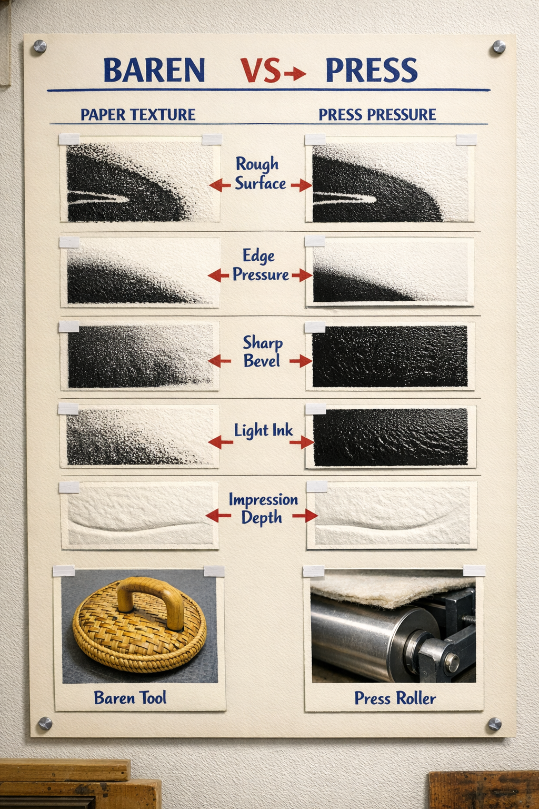</a>
  <br /><strong>Baren Versus Press Pressure Comparison Board</strong>
  <br /><sub>mixed-format · edge pressure · sharp bevel</sub>
</td>
<td width="50%" align="center" valign="top">
  <a href="prompts/2026/05/25/20260525-0211-relief-print-registration-and-brayer-course-plates/08-classroom-drying-rack-and-proof-wall-setup.prompt.md">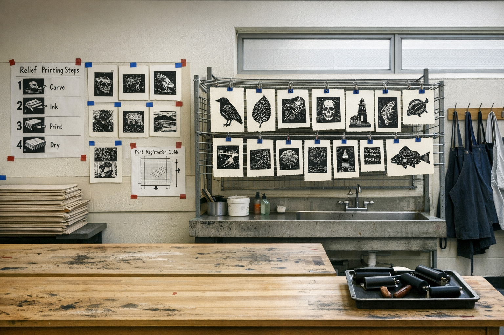</a>
  <br /><strong>Classroom Drying Rack And Proof Wall Setup</strong>
  <br /><sub>photorealistic-natural · fresh relief prints clipped to lines · wall of sample pulls and process posters</sub>
</td>
</tr>
<tr>
<td width="50%" align="center" valign="top">
  <a href="prompts/2026/05/25/20260525-0211-relief-print-registration-and-brayer-course-plates/09-press-bed-and-registration-rail-section-plate.prompt.md">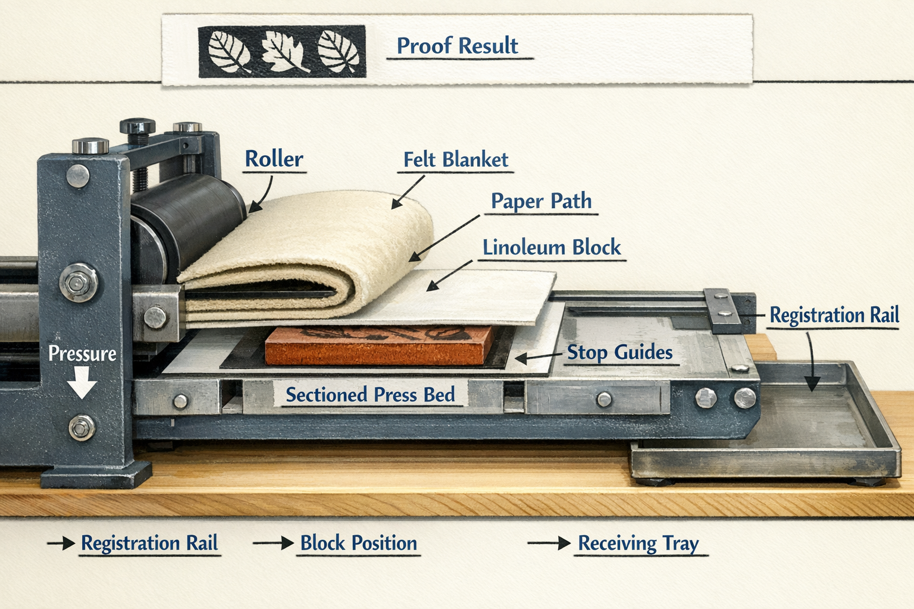</a>
  <br /><strong>Press Bed And Registration Rail Section Plate</strong>
  <br /><sub>mixed-format · sectioned press bed · felt blanket</sub>
</td>
<td width="50%" align="center" valign="top">
  <a href="prompts/2026/05/25/20260525-0211-relief-print-registration-and-brayer-course-plates/10-ghost-print-and-fresh-pull-proof-frame.prompt.md"></a>
  <br /><strong>Ghost Print And Fresh Pull Proof Frame</strong>
  <br /><sub>photorealistic-natural · one hand lifting fresh paper · one dark wet pull</sub>
</td>
</tr>
<tr>
<td width="50%" align="center" valign="top">
  <a href="prompts/2026/05/22/20260522-0220-cinematography-shot-size-and-blocking-visual-guides/05-shot-reverse-shot-coverage-board.prompt.md">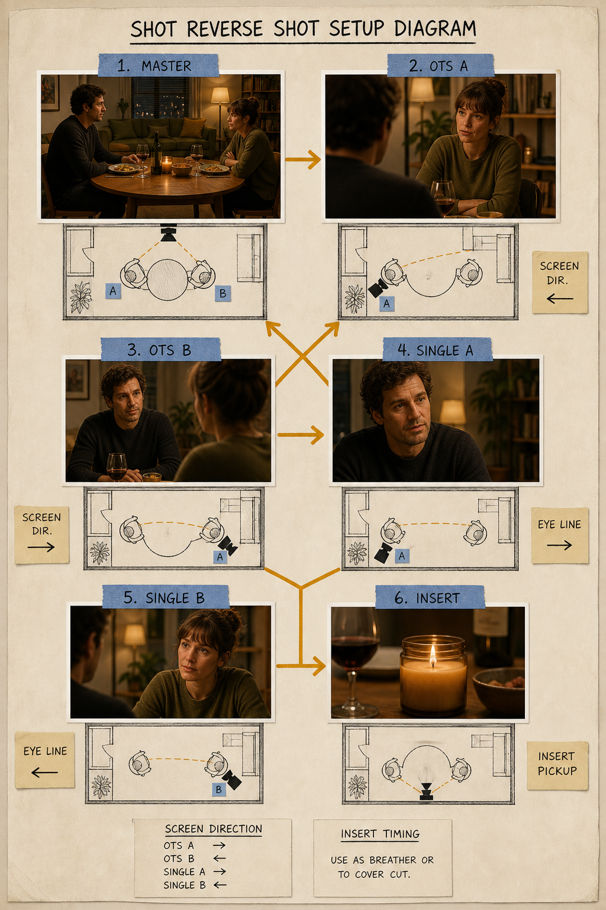</a>
  <br /><strong>Shot Reverse Shot Coverage Board</strong>
  <br /><sub>film-preproduction · one apartment dinner conversation broken into MASTER · SINGLE A</sub>
</td>
<td width="50%" align="center" valign="top">
  <a href="prompts/2026/05/22/20260522-0220-cinematography-shot-size-and-blocking-visual-guides/06-living-room-blocking-floor-map.prompt.md">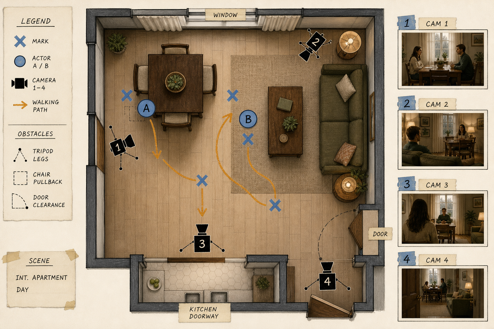</a>
  <br /><strong>Living Room Blocking Floor Map</strong>
  <br /><sub>film-preproduction · square dining table · kitchen doorway</sub>
</td>
</tr>
<tr>
<td width="50%" align="center" valign="top">
  <a href="prompts/2026/05/22/20260522-0220-cinematography-shot-size-and-blocking-visual-guides/07-apartment-dinner-scene-section-plate.prompt.md">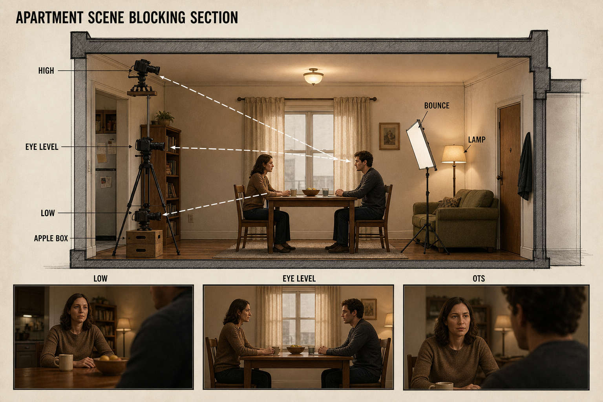</a>
  <br /><strong>Apartment Dinner Scene Section Plate</strong>
  <br /><sub>mixed-format · two actors seated opposite each other · curtained window</sub>
</td>
<td width="50%" align="center" valign="top">
  <a href="prompts/2026/05/22/20260522-0220-cinematography-shot-size-and-blocking-visual-guides/09-dinner-argument-storyboard-beat-page.prompt.md">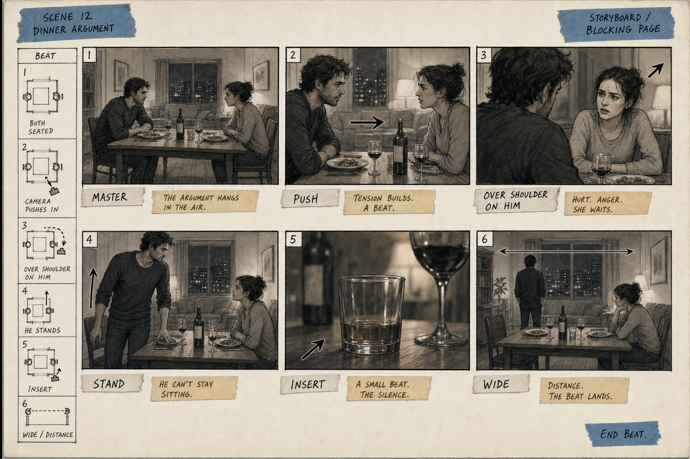</a>
  <br /><strong>Dinner Argument Storyboard Beat Page</strong>
  <br /><sub>storyboard-sequence · two actors seated at dinner · one actor stands</sub>
</td>
</tr>
<tr>
<td width="50%" align="center" valign="top">
  <a href="prompts/2026/05/22/20260522-0220-cinematography-shot-size-and-blocking-visual-guides/10-rehearsal-blocking-wall-installation-view.prompt.md">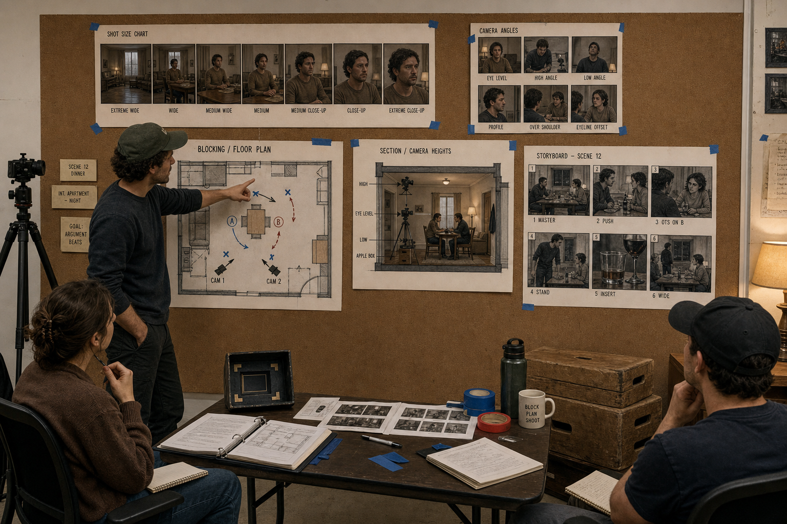</a>
  <br /><strong>Rehearsal Blocking Wall Installation View</strong>
  <br /><sub>film-preproduction · wall display containing a shot size chart · angle guide</sub>
</td>
<td width="50%" align="center" valign="top">
  <a href="prompts/2026/05/22/20260522-0220-cinematography-shot-size-and-blocking-visual-guides/11-window-side-cinematic-proof-frame.prompt.md"></a>
  <br /><strong>Window Side Cinematic Proof Frame</strong>
  <br /><sub>photorealistic-natural · with a wine bottle · wine glass</sub>
</td>
</tr>
<tr>
<td width="50%" align="center" valign="top">
  <a href="prompts/2026/05/21/20260521-1956-predictive-history-pressure-map-boards/01-predictive-history-thesis-board.prompt.md">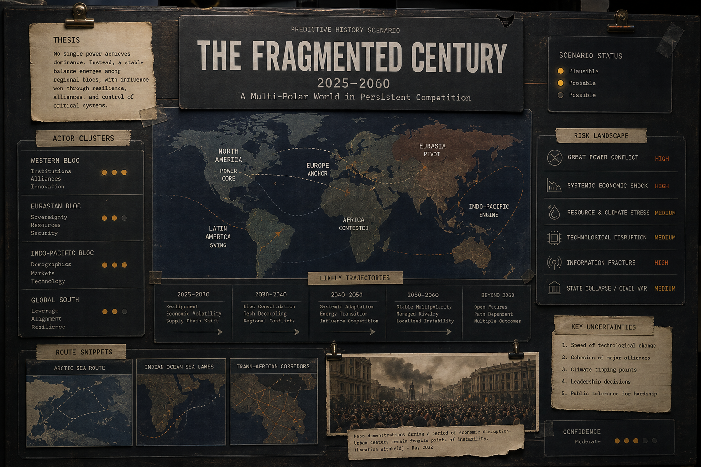</a>
  <br /><strong>Predictive History Thesis Board</strong>
  <br /><sub>data-visual · fragmented century thesis board · world trajectory map</sub>
</td>
<td width="50%" align="center" valign="top">
  <a href="prompts/2026/05/21/20260521-1956-predictive-history-pressure-map-boards/02-maritime-chokepoint-pressure-map.prompt.md"></a>
  <br /><strong>Maritime Chokepoint Pressure Map</strong>
  <br /><sub>data-visual · Gibraltar gate · Suez Canal</sub>
</td>
</tr>
<tr>
<td width="50%" align="center" valign="top">
  <a href="prompts/2026/05/21/20260521-1956-predictive-history-pressure-map-boards/05-resource-corridor-vulnerability-map.prompt.md">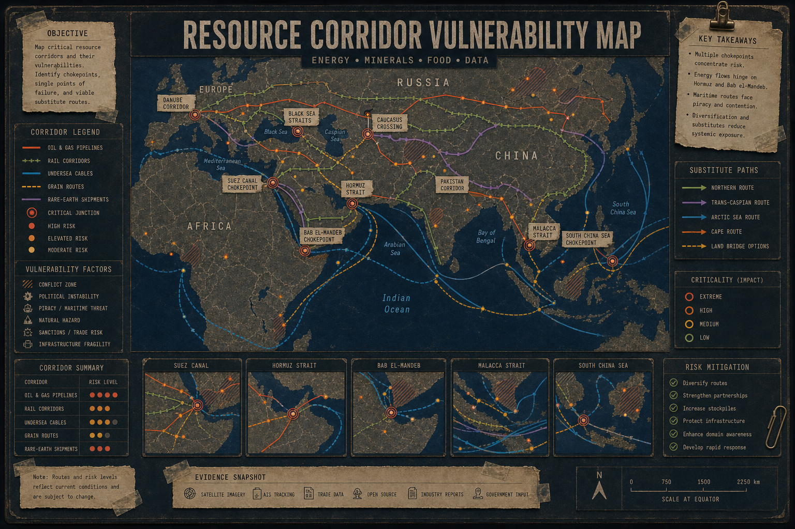</a>
  <br /><strong>Resource Corridor Vulnerability Map</strong>
  <br /><sub>data-visual · pipeline corridors · rail freight arteries</sub>
</td>
<td width="50%" align="center" valign="top">
  <a href="prompts/2026/05/21/20260521-1956-predictive-history-pressure-map-boards/06-historical-analogy-comparison-plate.prompt.md">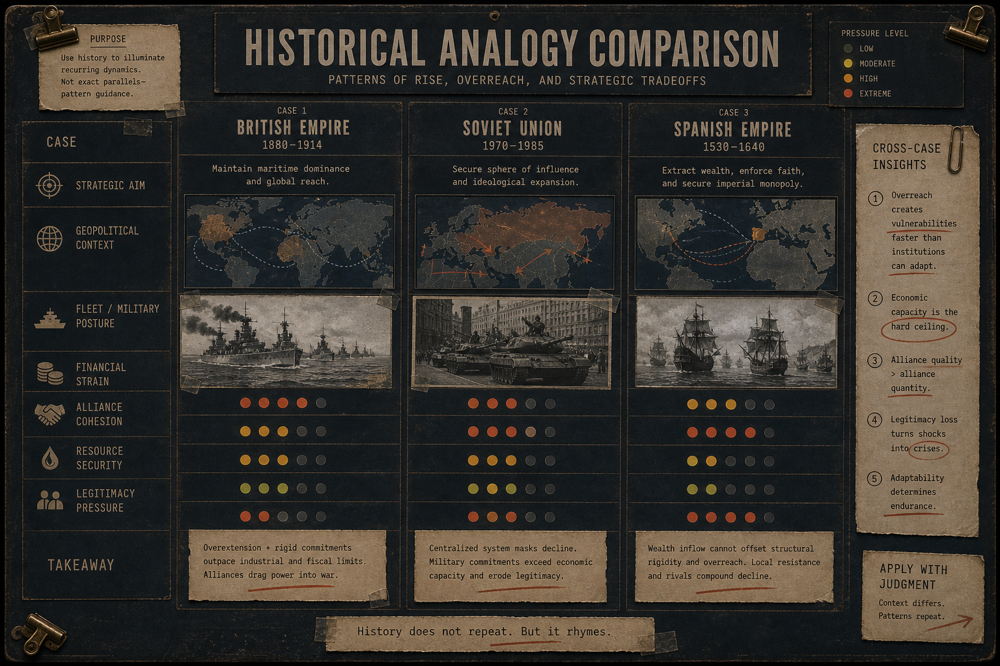</a>
  <br /><strong>Historical Analogy Comparison Plate</strong>
  <br /><sub>mixed-format · three case-study columns · dated map panels</sub>
</td>
</tr>
<tr>
<td width="50%" align="center" valign="top">
  <a href="prompts/2026/05/21/20260521-1956-predictive-history-pressure-map-boards/07-power-transition-stress-dashboard.prompt.md">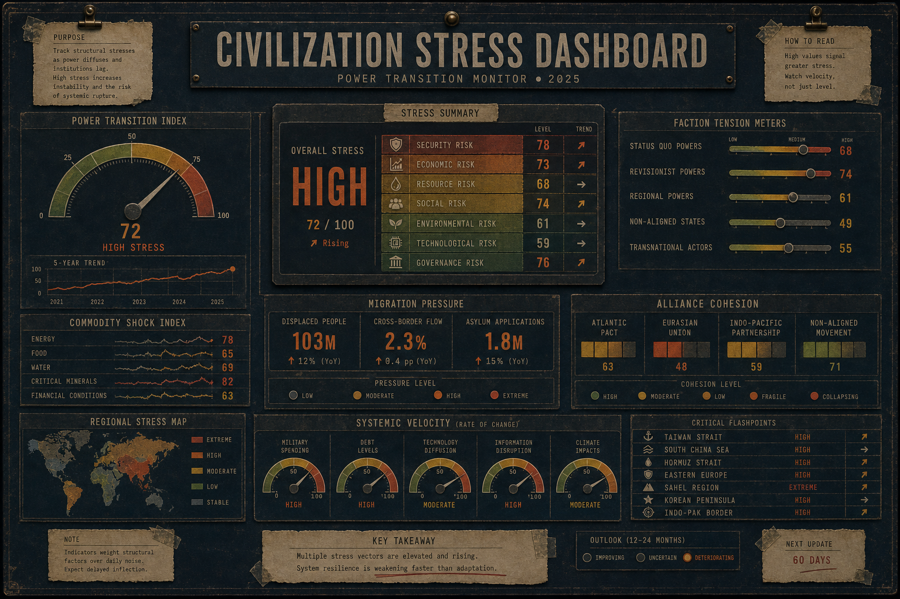</a>
  <br /><strong>Power Transition Stress Dashboard</strong>
  <br /><sub>data-visual · power transition index gauge · commodity shock chart</sub>
</td>
<td width="50%" align="center" valign="top">
  <a href="prompts/2026/05/21/20260521-1956-predictive-history-pressure-map-boards/10-night-briefing-cinematic-proof-frame.prompt.md"></a>
  <br /><strong>Night Briefing Cinematic Proof Frame</strong>
  <br /><sub>photorealistic-natural · lone analyst in shirtsleeves · giant scenario wall</sub>
</td>
</tr>
<tr>
<td width="50%" align="center" valign="top">
  <a href="prompts/2026/05/21/20260521-1653-beekeeping-brood-and-hive-inspection-posters/03-queen-cups-and-swarm-cells-poster.prompt.md">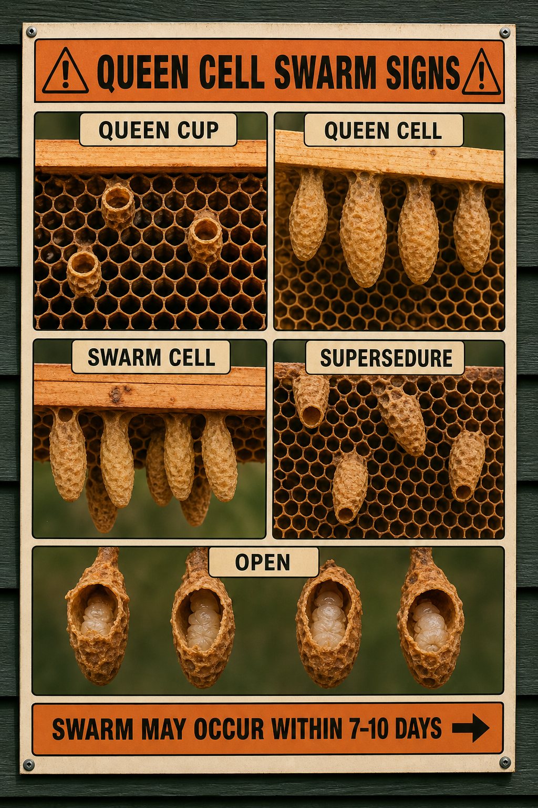</a>
  <br /><strong>Queen Cups And Swarm Cells Poster</strong>
  <br /><sub>infographic-diagram · close-up views of queen cups · queen cells</sub>
</td>
<td width="50%" align="center" valign="top">
  <a href="prompts/2026/05/21/20260521-1653-beekeeping-brood-and-hive-inspection-posters/03-queen-cups-and-swarm-cells-poster.prompt.md"></a>
  <br /><strong>Queen Cups And Swarm Cells Poster</strong>
  <br /><sub>infographic-diagram · close-up views of queen cups · queen cells</sub>
</td>
</tr>
<tr>
<td width="50%" align="center" valign="top">
  <a href="prompts/2026/05/21/20260521-1653-beekeeping-brood-and-hive-inspection-posters/04-beekeeping-inspection-tool-tray-reference.prompt.md">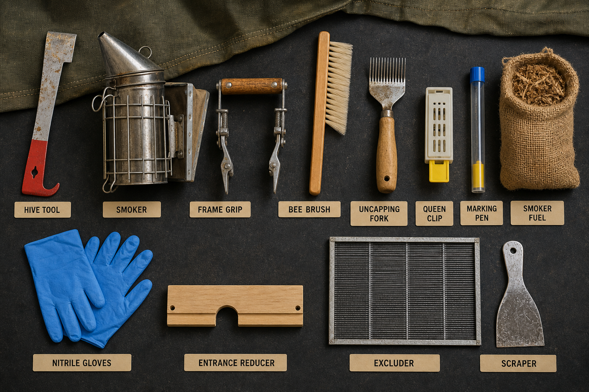</a>
  <br /><strong>Beekeeping Inspection Tool Tray Reference</strong>
  <br /><sub>atlas-contact-sheet · hive tool · frame grip</sub>
</td>
<td width="50%" align="center" valign="top">
  <a href="prompts/2026/05/21/20260521-1653-beekeeping-brood-and-hive-inspection-posters/04-beekeeping-inspection-tool-tray-reference.prompt.md"></a>
  <br /><strong>Beekeeping Inspection Tool Tray Reference</strong>
  <br /><sub>atlas-contact-sheet · hive tool · frame grip</sub>
</td>
</tr>
<tr>
<td width="50%" align="center" valign="top">
  <a href="prompts/2026/05/21/20260521-1653-beekeeping-brood-and-hive-inspection-posters/06-bee-smoker-lighting-steps-poster.prompt.md">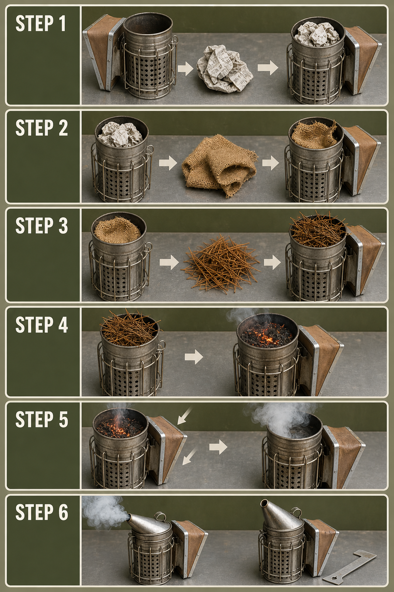</a>
  <br /><strong>Bee Smoker Lighting Steps Poster</strong>
  <br /><sub>infographic-diagram · crumpled paper starter · burlap layer</sub>
</td>
<td width="50%" align="center" valign="top">
  <a href="prompts/2026/05/21/20260521-1653-beekeeping-brood-and-hive-inspection-posters/06-bee-smoker-lighting-steps-poster.prompt.md"></a>
  <br /><strong>Bee Smoker Lighting Steps Poster</strong>
  <br /><sub>infographic-diagram · crumpled paper starter · burlap layer</sub>
</td>
</tr>
<tr>
<td width="50%" align="center" valign="top">
  <a href="prompts/2026/05/21/20260521-1653-beekeeping-brood-and-hive-inspection-posters/09-bee-veil-gloves-and-frame-grip-guide.prompt.md">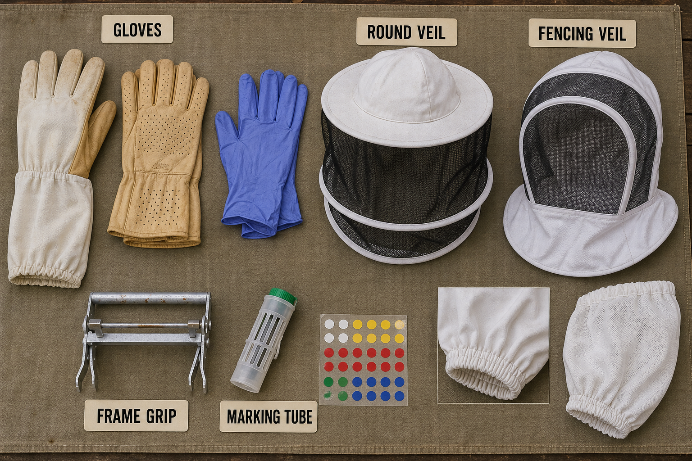</a>
  <br /><strong>Bee Veil Gloves And Frame Grip Guide</strong>
  <br /><sub>atlas-contact-sheet · long gauntlet gloves · ventilated leather gloves</sub>
</td>
<td width="50%" align="center" valign="top">
  <a href="prompts/2026/05/21/20260521-1553-aquarium-nitrogen-cycle-starter-posters/05-freshwater-tank-bacteria-zone-cutaway.prompt.md"></a>
  <br /><strong>Freshwater Tank Bacteria Zone Cutaway</strong>
  <br /><sub>mixed-format · sponge and ceramic media layers · return flow</sub>
</td>
</tr>
<tr>
<td width="50%" align="center" valign="top">
  <a href="prompts/2026/05/21/20260521-1553-aquarium-nitrogen-cycle-starter-posters/08-beginner-aquarium-cycling-station-setup.prompt.md"></a>
  <br /><strong>Beginner Aquarium Cycling Station Setup</strong>
  <br /><sub>photorealistic-natural · labeled test vials on a tray · clip thermometer</sub>
</td>
<td width="50%" align="center" valign="top">
  <a href="prompts/2026/05/21/20260521-1553-aquarium-nitrogen-cycle-starter-posters/09-local-fish-store-nitrogen-cycle-training-wall.prompt.md"></a>
  <br /><strong>Local Fish Store Nitrogen Cycle Training Wall</strong>
  <br /><sub>photorealistic-natural · one clear demo tank · jars of sponge and ceramic media</sub>
</td>
</tr>
<tr>
<td width="50%" align="center" valign="top">
  <a href="prompts/2026/05/21/20260521-1553-aquarium-nitrogen-cycle-starter-posters/10-aquarium-cycle-logbook-and-maintenance-card-spread.prompt.md"></a>
  <br /><strong>Aquarium Cycle Logbook And Maintenance Card Spread</strong>
  <br /><sub>productivity-visual · daily test card · water-change checklist</sub>
</td>
<td width="50%" align="center" valign="top">
  <a href="prompts/2026/05/21/20260521-1452-protective-braiding-training-guides/09-cosmetology-braiding-station-setup.prompt.md"></a>
  <br /><strong>Cosmetology Braiding Station Setup</strong>
  <br /><sub>photorealistic-natural · rat-tail combs in a crock · pre-stretched extension bundles on hooks</sub>
</td>
</tr>
<tr>
<td width="50%" align="center" valign="top">
  <a href="prompts/2026/05/21/20260521-1452-protective-braiding-training-guides/10-braiding-clinic-section-cutaway.prompt.md"></a>
  <br /><strong>Braiding Clinic Section Cutaway</strong>
  <br /><sub>mixed-format · styling chairs · mannequin-head shelf</sub>
</td>
<td width="50%" align="center" valign="top">
  <a href="prompts/2026/05/21/20260521-0440-lantern-kite-gecko-film-asset-bible/01-lantern-kite-gecko-turnaround-sheet.prompt.md"></a>
  <br /><strong>Lantern Kite Gecko Turnaround Sheet</strong>
  <br /><sub>character-bible · one small rooftop gecko courier shown in front · three-quarter views with the same patched shoulder cape</sub>
</td>
</tr>
<tr>
<td width="50%" align="center" valign="top">
  <a href="prompts/2026/05/21/20260521-0440-lantern-kite-gecko-film-asset-bible/02-lantern-kite-gecko-expression-and-reaction-pack.prompt.md"></a>
  <br /><strong>Lantern Kite Gecko Expression And Reaction Pack</strong>
  <br /><sub>animation-reference · annoyed repair face · slipping panic</sub>
</td>
<td width="50%" align="center" valign="top">
  <a href="prompts/2026/05/21/20260521-0440-lantern-kite-gecko-film-asset-bible/03-rooftop-gecko-species-dossier-plate.prompt.md"></a>
  <br /><strong>Rooftop Gecko Species Dossier Plate</strong>
  <br /><sub>species-dossier · tail ribbon counterbalance · satchel scale relation</sub>
</td>
</tr>
<tr>
<td width="50%" align="center" valign="top">
  <a href="prompts/2026/05/21/20260521-0440-lantern-kite-gecko-film-asset-bible/04-kite-repair-satchel-and-costume-detail-plate.prompt.md"></a>
  <br /><strong>Kite Repair Satchel And Costume Detail Plate</strong>
  <br /><sub>character-bible · couriers patched shoulder cape · rounded canvas satchel shown open and closed</sub>
</td>
<td width="50%" align="center" valign="top">
  <a href="prompts/2026/05/21/20260521-0440-lantern-kite-gecko-film-asset-bible/05-rooftop-chase-storyboard-beat-page.prompt.md"></a>
  <br /><strong>Rooftop Chase Storyboard Beat Page</strong>
  <br /><sub>storyboard-sequence · sprinting across tiles · skidding along a gutter</sub>
</td>
</tr>
<tr>
<td width="50%" align="center" valign="top">
  <a href="prompts/2026/05/21/20260521-0440-lantern-kite-gecko-film-asset-bible/06-bell-tower-rooftop-camera-blocking-board.prompt.md"></a>
  <br /><strong>Bell Tower Rooftop Camera Blocking Board</strong>
  <br /><sub>film-preproduction · over-shoulder pursuit · leap profile</sub>
</td>
<td width="50%" align="center" valign="top">
  <a href="prompts/2026/05/21/20260521-0440-lantern-kite-gecko-film-asset-bible/07-kite-catch-animation-timing-ladder.prompt.md"></a>
  <br /><strong>Kite Catch Animation Timing Ladder</strong>
  <br /><sub>animation-reference · launch stretch · airborne twist</sub>
</td>
</tr>
<tr>
<td width="50%" align="center" valign="top">
  <a href="prompts/2026/05/21/20260521-0440-lantern-kite-gecko-film-asset-bible/08-dusk-rooftop-continuity-environment-sheet.prompt.md"></a>
  <br /><strong>Dusk Rooftop Continuity Environment Sheet</strong>
  <br /><sub>film-preproduction · one main rooftop elevation · one simple location plan</sub>
</td>
<td width="50%" align="center" valign="top">
  <a href="prompts/2026/05/21/20260521-0440-lantern-kite-gecko-film-asset-bible/09-seedance-to-capcut-edit-planning-board.prompt.md"></a>
  <br /><strong>Seedance To CapCut Edit Planning Board</strong>
  <br /><sub>film-preproduction · with clear order and short labels only · no logos</sub>
</td>
</tr>
<tr>
<td width="50%" align="center" valign="top">
  <a href="prompts/2026/05/21/20260521-0440-lantern-kite-gecko-film-asset-bible/10-lantern-kite-recovery-cinematic-proof-frame.prompt.md"></a>
  <br /><strong>Lantern Kite Recovery Cinematic Proof Frame</strong>
  <br /><sub>illustration-story · same cape patch · spool charm</sub>
</td>
<td width="50%" align="center" valign="top">
  <a href="prompts/2026/05/14/20260514-0205-bicycle-repair-commuter-reference-sheets/08-bike-co-op-repair-stand-pegboard-reference.prompt.md"></a>
  <br /><strong>Bike Co-Op Repair Stand Pegboard Reference</strong>
  <br /><sub>photorealistic-natural · floor pump · tire levers</sub>
</td>
</tr>
<tr>
<td width="50%" align="center" valign="top">
  <a href="prompts/2026/05/14/20260514-0205-bicycle-repair-commuter-reference-sheets/09-public-commuter-repair-station-street-view.prompt.md"></a>
  <br /><strong>Public Commuter Repair Station Street View</strong>
  <br /><sub>photorealistic-natural · hanging repair arm · tethered hex keys</sub>
</td>
<td width="50%" align="center" valign="top">
  <a href="prompts/2026/05/14/20260514-0205-bicycle-repair-commuter-reference-sheets/10-commuter-rear-wheel-and-brake-section-cutaway.prompt.md"></a>
  <br /><strong>Commuter Rear Wheel And Brake Section Cutaway</strong>
  <br /><sub>mixed-format · inner tube · rim wall</sub>
</td>
</tr>
<tr>
<td width="50%" align="center" valign="top">
  <a href="prompts/2026/05/14/20260514-0105-bakery-icing-tip-comparison-wall/08-frosting-trouble-signs-training-wall.prompt.md"></a>
  <br /><strong>Frosting Trouble Signs Training Wall</strong>
  <br /><sub>photorealistic-natural · ragged star piping · air bubbles</sub>
</td>
<td width="50%" align="center" valign="top">
  <a href="prompts/2026/05/14/20260514-0105-bakery-icing-tip-comparison-wall/09-pastry-school-decorating-station.prompt.md"></a>
  <br /><strong>Pastry School Decorating Station</strong>
  <br /><sub>photorealistic-natural · practice cakes · piping bags</sub>
</td>
</tr>
<tr>
<td width="50%" align="center" valign="top">
  <a href="prompts/2026/05/14/20260514-0105-bakery-icing-tip-comparison-wall/10-cake-finishing-bench-section-cutaway.prompt.md"></a>
  <br /><strong>Cake Finishing Bench Section Cutaway</strong>
  <br /><sub>mixed-format · under-bench drawer storage for tips and couplers · piping-bag rack</sub>
</td>
<td width="50%" align="center" valign="top">
  <a href="prompts/2026/05/22/20260522-0220-cinematography-shot-size-and-blocking-visual-guides/04-180-degree-rule-overhead-diagram.prompt.md">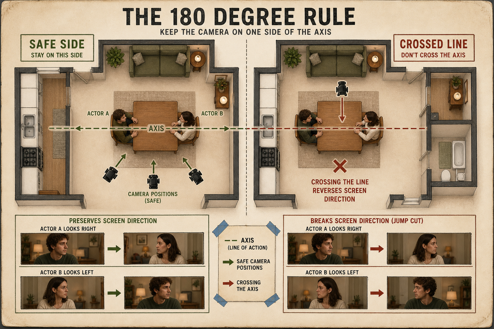</a>
  <br /><strong>180 Degree Rule Overhead Diagram</strong>
  <br /><sub>infographic-diagram · bold camera axis line between them · safe camera positions on one side</sub>
</td>
</tr>
<tr>
<td width="50%" align="center" valign="top">
  <a href="prompts/2026/05/21/20260521-1653-beekeeping-brood-and-hive-inspection-posters/01-healthy-and-patchy-brood-pattern-chart.prompt.md">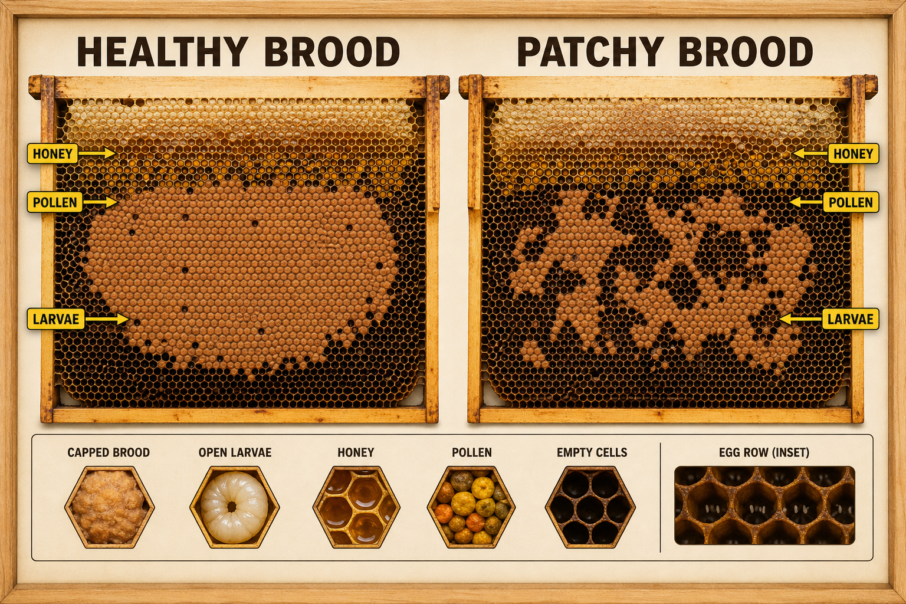</a>
  <br /><strong>Healthy And Patchy Brood Pattern Chart</strong>
  <br /><sub>scientific-educational · two brood frames shown side by side · plus honey band</sub>
</td>
<td width="50%" align="center" valign="top">
  <a href="prompts/2026/05/21/20260521-1653-beekeeping-brood-and-hive-inspection-posters/01-healthy-and-patchy-brood-pattern-chart.prompt.md"></a>
  <br /><strong>Healthy And Patchy Brood Pattern Chart</strong>
  <br /><sub>scientific-educational · two brood frames shown side by side · plus honey band</sub>
</td>
</tr>
<tr>
<td width="50%" align="center" valign="top">
  <a href="prompts/2026/05/21/20260521-1653-beekeeping-brood-and-hive-inspection-posters/02-capped-brood-honey-and-pollen-frame-guide.prompt.md">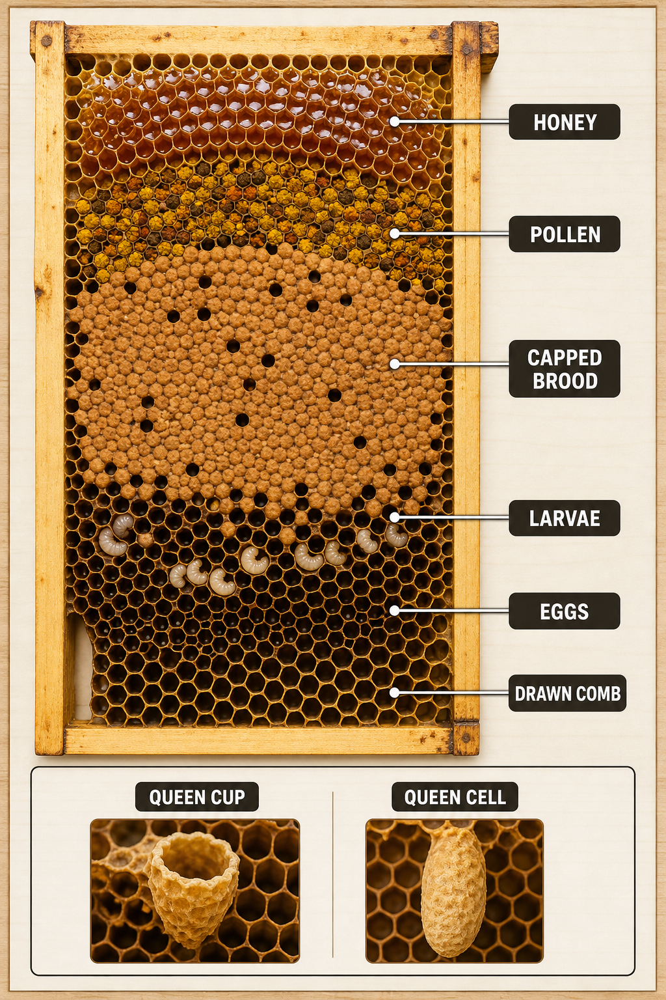</a>
  <br /><strong>Capped Brood Honey And Pollen Frame Guide</strong>
  <br /><sub>scientific-educational · pollen crescent · capped brood oval</sub>
</td>
<td width="50%" align="center" valign="top">
  <a href="prompts/2026/05/21/20260521-1653-beekeeping-brood-and-hive-inspection-posters/02-capped-brood-honey-and-pollen-frame-guide.prompt.md"></a>
  <br /><strong>Capped Brood Honey And Pollen Frame Guide</strong>
  <br /><sub>scientific-educational · pollen crescent · capped brood oval</sub>
</td>
</tr>
<tr>
<td width="50%" align="center" valign="top">
  <a href="prompts/2026/05/21/20260521-1653-beekeeping-brood-and-hive-inspection-posters/07-varroa-monitoring-board-comparison-guide.prompt.md">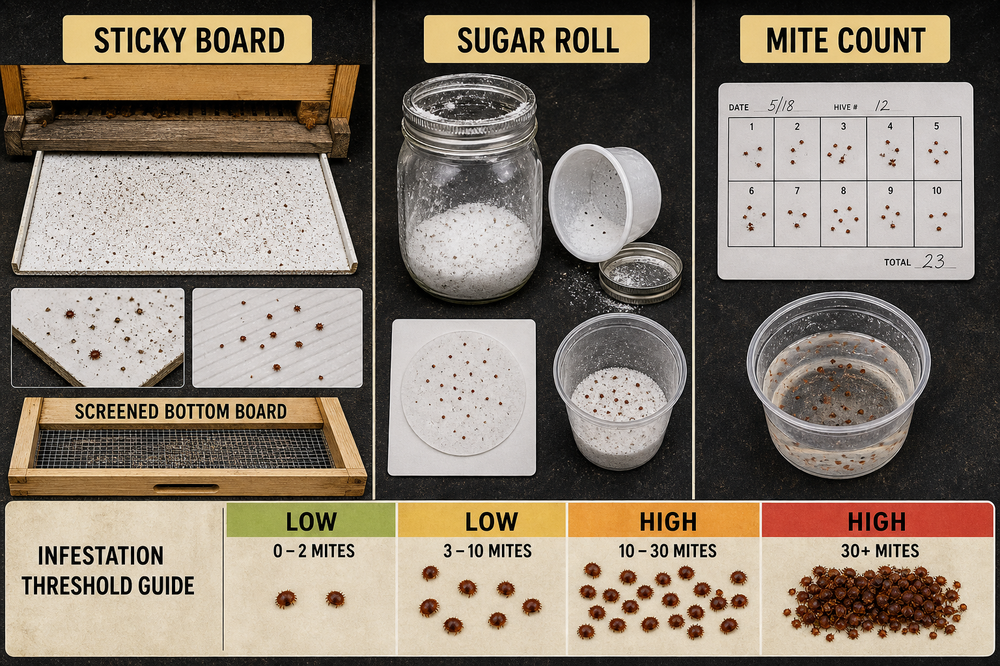</a>
  <br /><strong>Varroa Monitoring Board Comparison Guide</strong>
  <br /><sub>scientific-educational · sticky board tray · screened bottom board</sub>
</td>
<td width="50%" align="center" valign="top">
  <a href="prompts/2026/05/21/20260521-1653-beekeeping-brood-and-hive-inspection-posters/07-varroa-monitoring-board-comparison-guide.prompt.md"></a>
  <br /><strong>Varroa Monitoring Board Comparison Guide</strong>
  <br /><sub>scientific-educational · sticky board tray · screened bottom board</sub>
</td>
</tr>
<tr>
<td width="50%" align="center" valign="top">
  <a href="prompts/2026/05/21/20260521-1653-beekeeping-brood-and-hive-inspection-posters/09-bee-veil-gloves-and-frame-grip-guide.prompt.md"></a>
  <br /><strong>Bee Veil Gloves And Frame Grip Guide</strong>
  <br /><sub>scientific-educational · long gauntlet gloves · ventilated leather gloves</sub>
</td>
<td width="50%" align="center" valign="top">
  <a href="prompts/2026/05/21/20260521-1653-beekeeping-brood-and-hive-inspection-posters/05-langstroth-hive-box-section-diagram.prompt.md">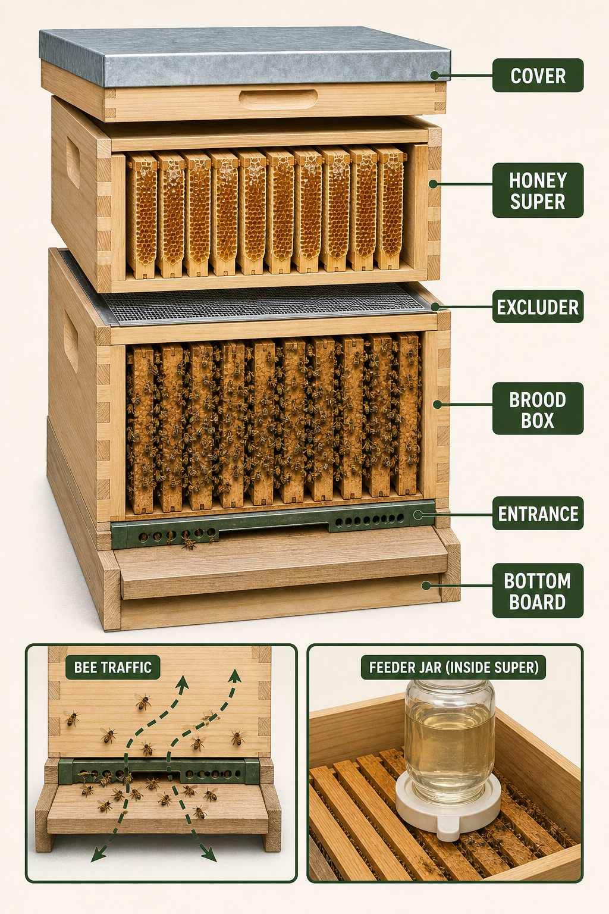</a>
  <br /><strong>Langstroth Hive Box Section Diagram</strong>
  <br /><sub>mixed-format · honey super · queen excluder</sub>
</td>
</tr>
<tr>
<td width="50%" align="center" valign="top">
  <a href="prompts/2026/05/21/20260521-1653-beekeeping-brood-and-hive-inspection-posters/05-langstroth-hive-box-section-diagram.prompt.md"></a>
  <br /><strong>Langstroth Hive Box Section Diagram</strong>
  <br /><sub>mixed-format · honey super · queen excluder</sub>
</td>
<td width="50%" align="center" valign="top">
  <a href="prompts/2026/05/21/20260521-1653-beekeeping-brood-and-hive-inspection-posters/08-apiary-inspection-station-setup.prompt.md">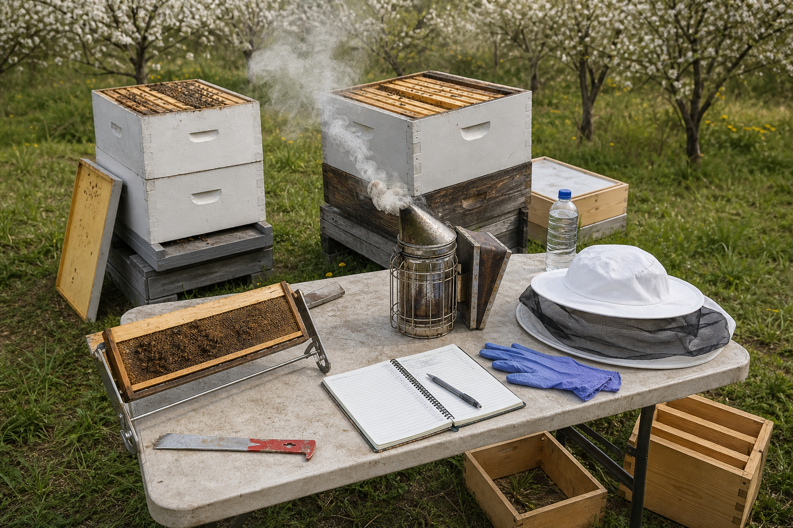</a>
  <br /><strong>Apiary Inspection Station Setup</strong>
  <br /><sub>photorealistic-natural · lit smoker sending a white plume · open brood frame on a frame holder</sub>
</td>
</tr>
<tr>
<td width="50%" align="center" valign="top">
  <a href="prompts/2026/05/21/20260521-1653-beekeeping-brood-and-hive-inspection-posters/08-apiary-inspection-station-setup.prompt.md"></a>
  <br /><strong>Apiary Inspection Station Setup</strong>
  <br /><sub>photorealistic-natural · lit smoker sending a white plume · open brood frame on a frame holder</sub>
</td>
<td width="50%" align="center" valign="top">
  <a href="prompts/2026/05/21/20260521-1653-beekeeping-brood-and-hive-inspection-posters/10-hive-inspection-logbook-and-frame-marking-cards.prompt.md">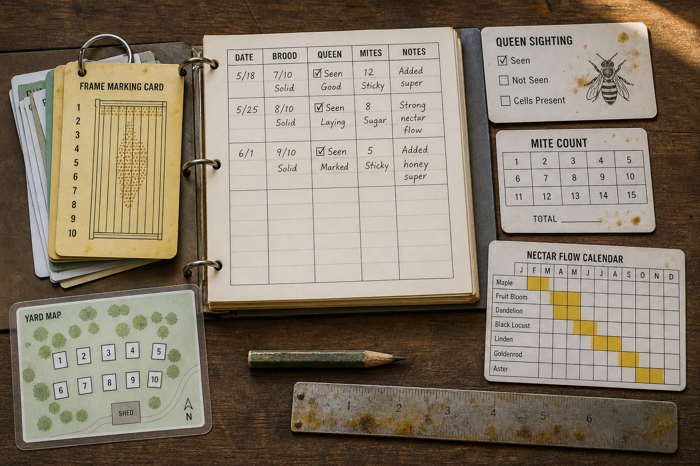</a>
  <br /><strong>Hive Inspection Logbook And Frame Marking Cards</strong>
  <br /><sub>productivity-visual · ring-bound frame marking cards · brood and queen logbook table</sub>
</td>
</tr>
<tr>
<td width="50%" align="center" valign="top">
  <a href="prompts/2026/05/21/20260521-1653-beekeeping-brood-and-hive-inspection-posters/10-hive-inspection-logbook-and-frame-marking-cards.prompt.md"></a>
  <br /><strong>Hive Inspection Logbook And Frame Marking Cards</strong>
  <br /><sub>productivity-visual · ring-bound frame marking cards · brood and queen logbook table</sub>
</td>
</tr>
</table>

## Useful Human Tasks In This Seed

| Panel | Human task | Labels |
| --- | --- | --- |
| Brayer Hardness And Texture Comparison Chart | Helps beginners compare how soft, medium, and hard brayers change line fidelity, solid coverage, and rough patch texture before they waste ink and paper | three relief-print brayers labeled soft, with side-by-side ink rolls, carved line samples |
| Carving Mark Vocabulary Reference Plate | Gives students and curriculum authors a concrete visual vocabulary for common carved textures, edge mistakes, and clean relief areas they see while cutting blocks | U gouge scoop, hatch marks, stipple pits |
| Reduction Print Step Sequence Poster | Shows the carve-print-carve rhythm of reduction linocut so students can understand shrinking printable areas and why each stage cannot be undone | second carve, second color, final carve |
| Relief Printing Tools Tray Reference | Maps the core beginner relief-print toolkit so teachers, students, and agents can distinguish cutting, inking, registration, burnishing, measuring, and cleanup objects | bench hook, V gouges, U gouges |
| Camera Angle And Eyeline Guide | Compares the most reusable dialogue-scene camera angles while also showing how eyeline placement and shoulder framing affect viewer orientation | HIGH ANGLE, LOW ANGLE, OVER SHOULDER |
| Director Viewfinder Tape Marks And Apple Boxes Atlas | Identifies the small physical tools that turn abstract blocking advice into practical set work | directors cardboard viewfinder, blue and red spike tape rolls, paper floor plan |

## Current Seed Run

- **Theme:** Relief Print Registration And Brayer Course Plates

- **Coverage:** 10 panels with prompt cards and a run report.

- **Run page:** [20260525-0211-relief-print-registration-and-brayer-course-plates](site/r/20260525-0211-relief-print-registration-and-brayer-course-plates/index.html)

## Publish Automation

1. Sync the newest useful run from the working atlas into this public repo:
   `node scripts/sync-public-atlas.mjs --source ../image-knowledge-base`
2. Rebuild the gallery data and generated README, then commit and push:
   `./scripts/run-public-sync.sh ../image-knowledge-base`
3. Install the local launchd watcher for continuous GitHub publishing:
   `./scripts/install-launch-agent.sh ../image-knowledge-base`

### Volume Profile

- Default public sync now targets `10+` images per run and publishes up to `3` new runs per cycle.
- Set `IMAGE_ATLAS_PUBLIC_MAX_NEW_RUNS=0` to allow unlimited new runs in one sync.
- Set `IMAGE_ATLAS_PUBLIC_MAX_NEW_IMAGES=200` to cap one publish pass by image count instead of run count.
- Set `IMAGE_ATLAS_PUBLIC_SYNC_INTERVAL_SECONDS=300` before installing the launch agent to publish every 5 minutes.
- Set `IMAGE_ATLAS_PUBLIC_MIN_IMAGES_PER_RUN=10` to keep the public mirror focused on substantial batches.

Example high-volume install:

```bash
IMAGE_ATLAS_PUBLIC_MAX_NEW_RUNS=5 \
IMAGE_ATLAS_PUBLIC_MAX_NEW_IMAGES=120 \
IMAGE_ATLAS_PUBLIC_MIN_IMAGES_PER_RUN=10 \
IMAGE_ATLAS_PUBLIC_SYNC_INTERVAL_SECONDS=300 \
./scripts/install-launch-agent.sh ../image-knowledge-base
```

## Repo Layout

- `images/`: published PNGs, grouped by date and run slug.
- `prompts/`: one prompt card per image with searchable hooks and composition notes.
- `research/`: run research briefs and visual lessons.
- `run-reports/`: concise run-level summaries.
- `catalog/`: machine-readable JSONL records used to build the site and README.
- `site/`: static visual browser with per-image pages, run pages, sitemap, and robots file.
